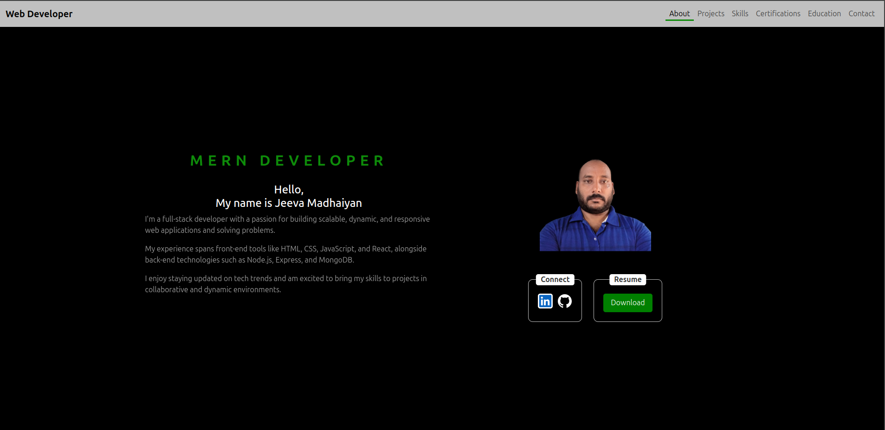

# Portfolio

#### [Portfolio live link](https://jeeva-madhaiyan.netlify.app)

### How to work with this?

1. Clone the repo

```
git clone https://github.com/jeelion22/jeeva-madhaiyan-portfolio.git
```

2. change directory and run npm install

```
cd jeeva-madhaiyan-portfolio
npm install
```

3. run npm

```
npm run dev
```

After a successful run, you'll endup with the local server run as

```

> jeeva-madhaiyan-portfolio@0.0.0 dev
> vite

Port 5173 is in use, trying another one...

  VITE v5.4.10  ready in 438 ms

  ➜  Local:   http://localhost:5174/
  ➜  Network: use --host to expose
  ➜  press h + enter to show help

```

### Screen shots of the portfolio



### How You Can Contribute

1. **Code Contributions**: Help develop new features, fix bugs, and optimize performance.
2. **Documentation**: Improve documentation to make it more accessible and comprehensive.
3. **Testing**: Contribute by testing the application and reporting issues or bugs.
4. **Feedback**: Provide feedback on usability, functionality, and potential improvements.

### Guidelines

- **Respect Privacy**: Ensure all contributions prioritize the privacy and safety of individuals involved.
- **Collaboration**: Work together with the community and maintain open communication.
- **Quality Assurance**: Follow best practices for code quality, security, and performance.

## License

MIT License
